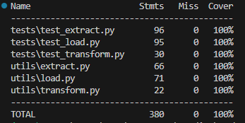

# 🧵 Fashion Product Data ETL Pipeline

Proyek ini merupakan implementasi pipeline **Extract-Transform-Load (ETL)** untuk mengumpulkan, membersihkan, dan menyimpan data produk fashion dari situs [fashion-studio.dicoding.dev](https://fashion-studio.dicoding.dev/). Proyek dikembangkan sebagai bagian dari submission akhir kelas **Belajar Fundamental Pemrosesan Data** di Dicoding.

---

## 🧱 Struktur Proyek
```markdown
.
├── .env                 #virtual environment
├── main.py
├── utils/
│   ├── extract.py       # Modul untuk scraping data dari web
│   ├── transform.py     # Modul untuk membersihkan dan mengubah data
│   └── load.py          # Modul untuk menyimpan data ke berbagai sumber
├── tests/
│   ├── test_extract.py  # Unit test untuk modul extract
│   ├── test_transform.py # Unit test untuk modul transform
│   └── test_load.py      # Unit test untuk modul load
├── products.csv         # Output data hasil ETL (jika sudah dijalankan)
└── README.md            # Dokumentasi proyek

````

---

## 🚀 Cara Kerja Pipeline

### 1. **Ekstraksi (Extract)**
- Mengambil semua data produk fashion dari halaman-halaman situs `fashion-studio.dicoding.dev` secara rekursif.
- Dilakukan menggunakan `requests` dan `BeautifulSoup`.

### 2. **Transformasi (Transform)**
- Membersihkan data dari produk yang tidak valid (`unknown`, harga tidak tersedia, rating tidak sah).
- Mengonversi harga ke Rupiah.
- Mengekstrak nilai numerik dari rating dan jumlah warna.
- Normalisasi kolom `size` dan `gender`.
- Drop baris yang mengandung nilai NaN setelah transformasi.

### 3. **Pemuatan (Load)**
- Menyimpan hasil transformasi ke tiga sumber:
  - **File CSV** (`products.csv`)
  - **Google Sheets** (via API service account)
  - **PostgreSQL Database**, dengan opsi `append` atau `overwrite`.

---

## 📦 Dependensi
Disarankan membuat vvirtual environment terlebih dahulu

```bash
pip install -r requirements.txt
````

**Isi `requirements.txt` (opsional):**

```
beautifulsoup4
requests
pandas
google-api-python-client
google-auth
google-auth-oauthlib
psycopg2-binary
```

---

## 🚀 Cara Menjalankan Program

Buka terminal pada direktori proyek, lalu jalankan:
```bash
python main.py
```

## 🧪 Pengujian

* Framework: `pytest` + `unittest.mock`
* Cakupan pengujian:

  * **fetching\_content** (HTTP success & failure)
  * **extract\_fashion\_data** (produk lengkap & tidak lengkap)
  * **scrape\_all\_pages** (multi page, early stop, empty content)
  * **transform\_fashion\_data** (valid, invalid, NaN)
  * **save\_to\_csv, Google Sheets, PostgreSQL** (success & failure)

Untuk menjalankan test:

```bash
python -m pytest tests
```

---

Untuk memelihat nilai test:

```bash
coverage run -m pytest tests
```
```bash
coverage report
```

## 📊 Hasil Coverage Test

Berikut adalah hasil pengujian dengan `coverage`, menunjukkan bahwa semua bagian penting dari sistem telah diuji:



## 🔐 Google Sheets Setup

1. Aktifkan Google Sheets API di [Google Cloud Console](https://console.cloud.google.com/).
2. Buat service account dan unduh `google-sheets-api.json`.
3. Share sheet Anda ke email service account.
4. Simpan ID Sheet Anda dan ganti variabel `sheet_id` di `main.py`.

---

## ⚙️ PostgreSQL Setup

Pastikan Anda memiliki:

* PostgreSQL terinstal dan aktif
* Konfigurasi `host`, `user`, `password`, `database` disesuaikan di `main.py`

Untuk membuat database otomatis, fungsi `create_database()` sudah disiapkan.

---

## 📊 Contoh Output

Contoh 5 data teratas hasil transformasi:

| title      | price     | rating | colors | size | gender | timestamp                     |
| ---------- | --------- | ------ | ------ | ---- | ------ | ----------------------------- |
| T-shirt    | 21634400.0| 3.9    | 3      | M    | women  | 2025-06-22T17:23:17.910986    |
| Hoodie     | 37950080.0| 4.8    | 3      | L    | unisex | 2025-06-22T17:23:17.910986    |
| Pants      | 47476960.0| 3.3    | 3      | XL   | men    | 2025-06-22T17:23:17.910986    |
| Outerwear  | 55145440.0| 3.5    | 3      | XXL  | women  | 2025-06-22T17:23:17.910986    |
| Jacket     | 62453920.0| 3.3    | 3      | S    | unisex | 2025-06-22T17:23:17.911984    |

---

## 👨‍💻 Kontributor

* **Dragan Abrisam Widijanto**
  Machine Learning Engineer | Universitas Gadjah Mada
  📧 [draganabrisamwidijanto@mail.ugm.ac.id](mailto:draganabrisamwidijanto@mail.ugm.ac.id)
  🔗 [LinkedIn](https://linkedin.com/in/draganabrisamwidijanto/)

---

## 📝 Lisensi

MIT License © 2025 — Dicoding Submission Project
